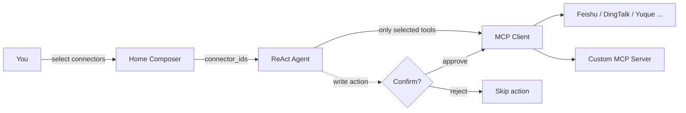

# MCP 连接器

**MCP 连接器** 通过 **模型上下文协议 (MCP)** 连接到外部服务，让您的 DB-GPT 代理能够超越数据库 - 发送消息、读写文档、管理问题和搜索网络。

激活内置模板或插入任何自定义 MCP 服务器，然后在 Composer 中选择所需的连接器。代理只能看到您选择的工具，任何写入操作都会先暂停以供您确认。

:::info 什么是 MCP？
[模型上下文协议](https://modelcontextprotocol.io) 是一个开放标准，为 AI 应用程序提供了与外部工具和服务进行通信的统一方式。 DB-GPT 中的每个连接器均由 MCP 服务器支持，因此添加新功能就像指向其端点一样简单。
:::

## 亮点

- **内置模板** — 一键激活飞书、钉钉、语雀、GitHub、Notion、Linear、Tavily、DeepWiki。
- **自定义 MCP 服务器** — 使用您自己的身份验证连接任何 SSE 或可流式 HTTP MCP 端点。
- **按对话选择** — 选择要在 Composer 中附加的连接器；代理的提示保持专注且高效。
- **人机交互确认** — 写入操作（创建/更新/删除）在运行之前会弹出一个确认对话框。
- **工具透明度** — 检查任何连接器的完整工具列表，包括参数和说明。
- **安全凭证** — 令牌在静态时进行加密，并在进程重新启动后继续存在。

## 它是如何工作的

连接器处于以下三种状态之一：

|状态|意义|
| --- | --- |
| **可用** |目录中的模板或通用“自定义 MCP”条目 - 尚未配置。 |
| **活跃** |配置凭据并连接；它的工具已经可以使用了。 |
| **附上** |在当前对话中选择 - 代理实际上注入其工具。 |

## 内置连接器

|连接器|类别 |默认运输 |典型工具|
| --- | --- | --- | --- |
|飞书 |通讯 |上交所 |发送消息、读/写文档、日历 |
|钉钉 |通讯 |上交所 |群组消息、机器人通知 |
|语雀|文件|上交所 |读/写知识库文档 |
| GitHub |项目|流式 HTTP |问题、PR、存储库管理 |
|概念 |文件|流式 HTTP |页面和数据库读/写|
|线性|项目|流式 HTTP |问题/项目协作 |
|塔维利 |搜索 |流式 HTTP | LLM 优化的网络搜索，返回 Markdown |
|深度维基 |开发工具|流式 HTTP |任意 GitHub 存储库上的 AI 阅读和问答 |

## 管理连接器

打开 **连接器** 页面以卡片形式查看每个模板和自定义服务器。每张卡片都会显示图标、名称、“模板”/“自定义”徽章、其类别、“MCP / SSE”（或可流式 HTTP）传输以及简短说明。使用搜索框和**全部/活动/非活动/需要注意**选项卡进行过滤。

<p对齐=“中心”>
  

- **模板卡**显示“激活”按钮 - 单击它即可填写凭据并连接。
- **活动卡** 显示“● 活动”徽章和用于测试连接、编辑或删除的快速操作。

### 添加连接器

单击 **添加连接器** 打开对话框：

<p对齐=“中心”>
  

|领域 |描述 |
| --- | --- |
| **连接器名称** |此连接器的显示名称。 |
| **连接器类型** |选择内置模板或**自定义 MCP 服务器**。 |
| **传输协议** | **流式 HTTP**（默认）或 **SSE**。 |
| **身份验证类型** | `none`、`bearer` 或 `token` — 根据需要显示令牌/标头字段。 |
| **连接器说明** |选修的。显示在代理的工具说明中。 |

对于自定义服务器，只需提供端点 URL、传输和身份验证。凭证在存储之前会被加密。

### 检查工具

打开连接器的详细信息以浏览它公开的每个工具。该面板列出了每个工具名称及其描述和**输入参数**表（名称、类型、必需、描述）——有助于准确理解代理可以调用​​的内容。

<p对齐=“中心”>
  

## 在对话中使用连接器

1. 在主页上，打开 Composer 工具栏中的连接器选取器（**选择 MCP**）。
2. 勾选一个或多个连接器。作曲家会显示所选的计数，而代理只会获得这些连接器的工具。
3.提出你的问题。当代理需要工具时，它会自动调用它。
4. 如果代理触发**写入操作**（例如，创建文档或发送消息），则会出现确认对话框。批准运行它，或拒绝跳过 - 代理将继续任一方式。

:::tip 为什么选择很重要
仅连接您需要的连接器可以使代理的提示保持集中，减少令牌使用，并防止模型选择错误的工具。
:::

## 注意事项和限制

- 内置模板附带合理的“确认”操作（写入操作需要确认）；在此版本中，自定义 MCP 工具无需确认即可运行。
- 凭据的范围是针对每个用户的，并在重新启动后自动恢复。
- 如果服务器在启动时离线，其连接器会被标记，以便您可以从卡上重新测试它。