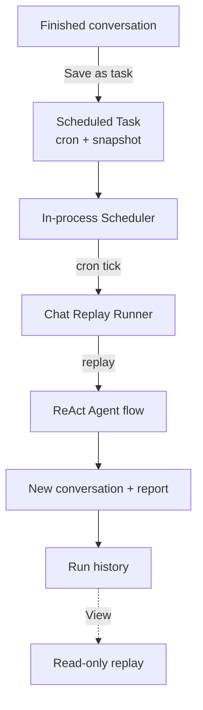

# 计划任务

**计划任务**将一次性对话变成一项重复性工作。运行一次数据分析，将其保存为任务，DB-GPT 会按 cron 计划重播整个 ReAct Agent 流程 - 每次都会生成一份新报告。

每次运行都会产生一个全新的对话，您可以稍后重播，因此您始终可以了解生成内容和生成时间的完整历史记录。

:::info 内置，零配置
调度程序在 Web 服务器进程内运行并自动启动。无需部署额外的服务。
:::

## 亮点

- **保存任何对话** — 将已完成的对话（问题+模型+选定的技能/连接器）冻结为可重复的任务。
- **灵活的计划** — 选择预设（每小时/每日/每周/每月）或编写自定义 cron 表达式，并提供实时“下一次运行”预览。
- **自动重播** — 在每个 cron 滴答处，代理重新运行完整流程并将结果写入历史记录。
- **执行历史记录** — 每次运行都会记录其状态、持续时间和结果摘要。
- **重播而不重新运行** — 打开任何过去的运行以查看其对话快照 — 纯读取，零 LLM 调用。
- **重新启动自我修复** — 当进程重新启动时，启用的任务将重新加载到调度程序中。

## 它是如何工作的

## 将对话保存为任务

对话生成报告后，从主页打开**另存为计划任务**。

<p对齐=“中心”>
  

|领域 |描述 |
| --- | --- |
| **任务名称** |必需的。任务的名称。 |
| **描述** |选修的。 A note about what the task does. |
| **频率** |原始 cron 表达式的“每小时”/“每日”/“每周”/“每月”或“自定义”。 |
| **Cron 表达式** |当您调整频率时实时显示（例如“0 9 * * *”）。 |

The **"Will reuse this conversation environment (read-only)"** section shows the frozen context — the model and the original question — that each run will replay.单击“**保存并启用**”以创建任务并安排它。

## 管理任务

**计划任务**页面列出了每个任务及其状态、cron 表达式、下次运行时间和创建者。使用搜索框和**全部/已启用/已暂停**选项卡进行过滤，并使用**启用**切换来暂停或恢复任务。

<p对齐=“中心”>
  

|专栏 |描述 |
| --- | --- |
| **任务名称** |名称和描述。 |
| **状态** | “已启用”或“已暂停”。 |
| **Cron 表达式** |活动时间表。 |
| **下次运行** |下次任务何时触发。 |
| **创作者** |谁创建了任务。 |
| **启用** |切换暂停/恢复。 |
| **行动** |编辑或删除。 |

## 任务详细信息和执行历史记录

打开任务以查看其完整配置和运行历史记录。

<p对齐=“中心”>
  

- **基本信息** — 状态、cron 表达式、下次运行、创建者、创建时间。
- **任务环境（只读）** — 每次运行都会重播的原始问题、模型和数据库。
- **执行历史记录** — 最近的运行，每个运行都有状态（“成功”/“失败”/“超时”/“正在运行”）、开始时间、持续时间和结果摘要。

单击任何运行上的 **查看** 即可跳转到主页并**重播该运行的对话** - 完整的步骤流和报告从历史记录中恢复，无需 LLM 调用。顶部的横幅提醒您对话是由计划任务生成的，并带有返回任务详细信息的链接。

## 它是如何运行的

1. 进程内调度程序为每个已启用的任务保留一个作业，由其 cron 表达式控制。
2. 当作业触发时，运行程序将启动 **新对话** 并针对代理重播保存的请求。
3. 记录运行及其状态、摘要以及用于重播的新对话 ID。
4. 运行是独立的——针对该运行记录失败，并且任务只是等待下一个滴答。

:::tip 重播是只读的
“查看”从数据库加载过去运行的存储对话。它永远不会重新执行代理，因此它是即时且免费的。
:::

## 注意事项和限制

- 任务不会在失败时重试 - 记录失败或超时的运行，并且任务等待下一个计划时间。
- 每次运行都有严格的执行超时，以防止代理失控。
- 在此版本中，任务在用户之间共享（显示创建者以供审核）；每个用户的隔离和通知计划稍后进行。