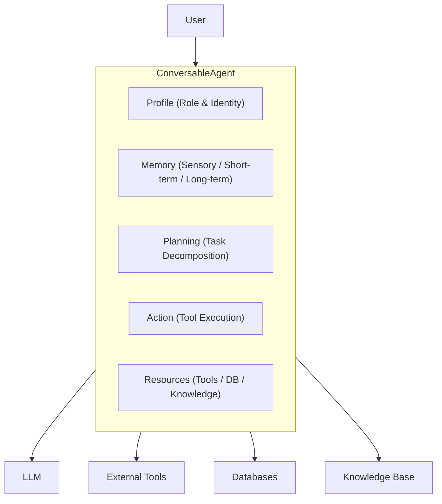

# 代理框架

DB-GPT 提供了一个**数据驱动的多代理框架**，用于构建自主人工智能代理，这些代理可以协作、使用工具、访问数据库并在对话中维护内存。

## 代理架构

DB-GPT 中的每个代理都是围绕五个核心模块构建的：

|模块|目的|
|---|---|
| **简介** |定义代理的角色、名称、目标和约束 |
| **内存** |存储对话历史记录和学到的信息 |
| **规划** |将复杂的任务分解为可执行的步骤 |
| **行动** |执行工具、查询和其他操作 |
| **资源** |提供对工具、数据库、知识库的访问 |

## 关键概念

### 对话代理

所有代理的基类。它实现对话循环：接收消息、思考（计划）、行动、响应。

### 多代理协作

多个代理可以一起完成复杂的任务：

- **顺序** — 代理按顺序相互传递结果
- **并行** — 多个代理同时处理子任务
- **经理-工人** — 规划代理人委托给专业代理人

### 内存类型

|内存类型 |范围 |坚持|
|---|---|---|
| **感官** |当前留言 |无 |
| **短期** |当前对话 |会议|
| **长期** |跨对话|数据库|
| **混合** |结合所有三个 |混合|

### 内置代理类型

DB-GPT 包括几个预构建的代理：

- **数据分析代理** — 分析数据、生成 SQL、创建图表
- **Summary Agent** — 总结长文档和对话
- **代码代理** — 生成并执行代码
- **聊天代理** — 通用对话代理

## 简单示例
```python
from dbgpt.agent import ConversableAgent, AgentContext

# Define a simple custom agent
agent = ConversableAgent(
    name="DataAnalyst",
    role="You are a data analysis expert",
    goal="Help users analyze data and generate insights",
    llm_config={"model": "chatgpt_proxyllm"},
)

# Start a conversation
result = await agent.a_send("Analyze the sales trends for Q4 2024")
```
## 接下来是什么

- [Agent介绍](/docs/agents/introduction/) — 详细的Agent框架指南
- [自定义代理](/docs/agents/introduction/custom_agents) — 构建您自己的代理
- [代理工具](/docs/agents/introduction/tools) — 将代理连接到工具
- [Agent Planning](/docs/agents/introduction/planning) — 任务分解策略