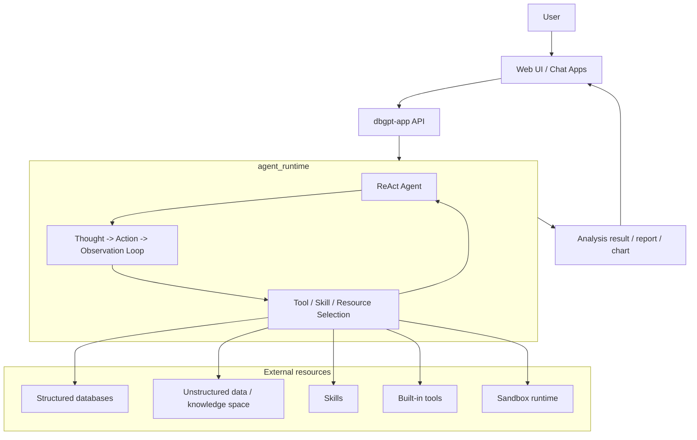

# 架构

DB-GPT 被组织为具有以 ReAct 为中心的代理运行时的 Python monorepo。
Web UI 向应用层发送请求，ReAct Agent 在一个
代理运行时循环，代理使用工具、技能、数据库和知识
资源以将分析结果返回给 UI。

## 存储库布局
```text
DB-GPT/
├── packages/
│   ├── dbgpt-core/        # Core agent, memory, planning, RAG, model abstractions
│   ├── dbgpt-app/         # Application server, API routes, scenes, UI asset hosting
│   ├── dbgpt-serve/       # Service layer: knowledge, flow, agent resources, app services
│   ├── dbgpt-ext/         # Extensions: datasources, storage backends, RAG connectors
│   ├── dbgpt-client/      # Python client SDK
│   ├── dbgpt-sandbox/     # Sandbox execution runtime for safe code/tool execution
│   └── dbgpt-accelerator/ # Acceleration packages
├── web/                   # Next.js Web UI
├── skills/                # Built-in skills and reusable workflows
├── configs/               # TOML configuration files
└── docs/                  # Docusaurus documentation
```
## 包角色

|套餐 |角色 |
|---|---|
| `dbgpt-核心` |核心代理框架、ReAct 解析器/动作流、内存、规划、RAG、模型接口 |
| `dbgpt-app` | FastAPI 应用服务器、聊天 API、运行时编排、静态 UI 托管 |
| `dbgpt-serve` |知识、数据源、流程、应用程序和代理支持的资源服务 |
| `dbgpt-ext` |外部连接器，例如数据库/存储/RAG 集成 |
| `dbgpt-客户端` | DB-GPT API 的客户端 SDK |
| `dbgpt-沙箱` |代码和工具执行的隔离执行运行时 |
| `技能/` |打包的域工作流程、脚本、模板和参考 |

## 高层架构

## 它是如何工作的

1. 用户与 Web UI 或其他客户端交互。
2. `dbgpt-app` 接收请求并将其路由到代理聊天 API。
3. 请求进入`agent_runtime`执行循环。
4. ReAct Agent 逐步推理并选择下一步操作。
5.代理根据需要加载并使用外部资源：
   - 用于SQL分析的结构化数据库
   - 用于检索的非结构化知识空间
   - 可重用工作流程的技能
   - 用于任务执行的内置工具
   - 用于安全代码执行的沙箱运行时
6. 代理结合观察结果并产生最终分析输出。
7. 结果返回到 UI 进行显示。

## 代理运行时模型

运行时是驱动 ReAct 循环的概念执行层。
在代码库中，这是通过代理构建器、资源管理器实现的，
ReAct 解析器/操作流，以及连接到 UI 的 API 流处理程序。

关键实施锚点：

- `packages/dbgpt-core/src/dbgpt/agent/expand/react_agent.py`
- `packages/dbgpt-core/src/dbgpt/agent/util/react_parser.py`
- `packages/dbgpt-app/src/dbgpt_app/openapi/api_v1/agentic_data_api.py`
- `web/hooks/use-react-agent-chat.ts`
- `packages/dbgpt-sandbox/src/dbgpt_sandbox/sandbox/execution_layer/runtime_factory.py`

## 代理使用的资源

### 结构化数据

数据库和可查询的表格源用于 SQL 风格的分析、模式
链接和报告生成。

### 非结构化数据

知识空间和文档集合提供检索支持
非结构化内容。

### 技能

内置技能将可重复的工作流程打包成可重用的任务单元。代理
可以在会话期间加载并执行它们。

### 内置工具

工具包括 SQL 执行、shell/代码执行、HTML 渲染、搜索和
通过资源管理器注册的其他特定于任务的操作。

## 结果传递

输出路径被设计为面向用户：

`ReAct Agent`→`agent_runtime`→`流结果`→`Web UI`

这使得该架构适合交互式数据分析、报告
生成和工具辅助推理。