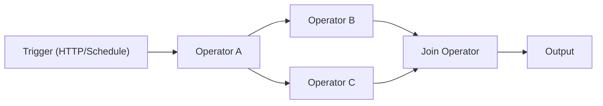

# AWEL（代理工作流表达语言）

AWEL 是一种特定于领域的语言，专为构建 LLM 申请工作流程而设计。它允许您使用一组内置运算符将复杂的 AI 管道组合为 **有向无环图 (DAG)**。

## 为什么是 AWEL？

传统的 LLM 应用程序开发涉及分散的 API 调用、脆弱的粘合代码和难以维护的管道。 AWEL 通过提供以下功能解决了这个问题：

- **声明式 DAG** — 定义管道的用途，而不是如何连接它
- **可重用运算符** — 由内置和自定义运算符组成
- **Stream-native** — 对实时响应的一流流支持
- **可视化编辑器** — Web UI 中的 AWEL Flow，用于无代码工作流程构建

## 它是如何工作的

AWEL 管道包括：

1. **触发器** — 入口点（HTTP 请求、调度或手动调用）
2. **算子**——转换数据的处理节点
3. **DAG**——连接触发器和算子的图

## 核心运营商

|操作员|描述 |使用案例 |
|---|---|---|
| **地图操作员** |变换每个输入项 |数据格式化、API 调用 |
| **归约运算符** |将多个输入聚合为一个 |总结、收藏|
| **加入运营商** |合并并行分支的结果 |多源聚合|
| **分行经营者** |将输入路由到不同的路径 |条件逻辑|
| **StreamifyOperator** |将批处理转换为流 |实时处理|
| **UnstreamifyOperator** |将流转换为批 |收集流结果 |
| **TransformStreamOperator** |转换流中的项目 |流过滤/映射|
| **输入操作符** |向 DAG 提供初始输入 |管道入口数据|

## 简单示例

接受用户问题并生成 LLM 响应的最小 AWEL 工作流程：
```python
from dbgpt.core.awel import DAG, MapOperator, InputOperator

with DAG("simple_chat") as dag:
    input_node = InputOperator(input_source="user_question")
    llm_node = MapOperator(map_function=call_llm)
    input_node >> llm_node
```
## AWEL Flow（可视化编辑器）

Web UI 包括一个拖放式 AWEL Flow 编辑器，您可以在其中：

- 通过连接操作员节点可视化地构建工作流程
- 在侧栏中配置每个操作员的参数
- 实时测试和调试流程
- 保存和共享流程模板

从 **AWEL Flow** 下的 Web UI 侧边栏访问它。

## 接下来是什么

- [AWEL 教程](/docs/awel/tutorial) — 分步学习路径
- [AWEL Cookbook](/docs/awel/cookbook) — 常见模式的实用食谱
- [AWEL Flow 用法](/docs/application/awel) — 使用可视化编辑器