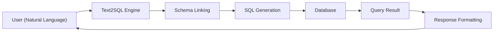

# 数据源

DB-GPT 连接到广泛的数据源，支持与数据库、电子表格和数据仓库的自然语言交互。

## 支持的数据源

|数据来源|类型 |状态 |
|---|---|---|
| **SQLite** |关系 |内置（默认）|
| **MySQL** |关系 |支持 |
| **PostgreSQL** |关系 |支持 |
| **点击屋** |联机分析处理 |支持 |
| **DuckDB** |分析|支持 |
| **MSSQL** |关系 |支持 |
| **甲骨文** |关系 |支持 |
| **Excel** |电子表格 |支持 |
| **CSV** |平面文件 |支持 |

## 它是如何工作的

1. **用户**用自然语言提出问题
2. **Text2SQL** 引擎分析问题和链接的数据库模式
3.根据问题上下文生成**SQL**
4. **数据库**执行查询
5. **结果** 被格式化并返回（可选地带有图表）

## 添加数据源

### 通过网络用户界面

1. 打开 DB-GPT Web UI
2. 转到侧边栏中的**数据源**
3. 单击“**添加数据源**”
4.选择数据库类型并填写连接详细信息
5.测试连接并保存

### 通过配置

数据源连接也可以在 TOML 配置文件中配置或通过 REST API 进行管理。

## 文本2SQL

DB-GPT 擅长将自然语言转换为 SQL 查询：

- **模式链接** — 自动将自然语言术语映射到表/列名称
- **多轮对话** — 通过后续问题完善查询
- **图表生成** — 将查询结果可视化为图表和仪表板
- **微调** — 优化您特定域的 Text2SQL 准确性

:::提示
为了获得最佳 Text2SQL 结果，请确保您的数据库表和列具有描述性名称和注释。
:::

## 接下来是什么

- [聊天数据库](/docs/application/apps/chat_db) — 与您的数据库聊天
- [聊天 Excel](/docs/application/apps/chat_excel) — 与 Excel 文件聊天
- [聊天仪表板](/docs/application/apps/chat_dashboard) — 构建数据仪表板
- [数据源集成](/docs/installation/integrations) — 安装附加连接器
- [连接模块](/docs/modules/connections) — 深入研究数据源管理