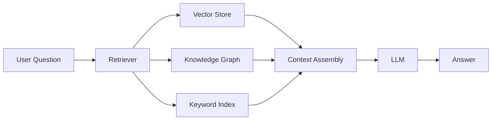
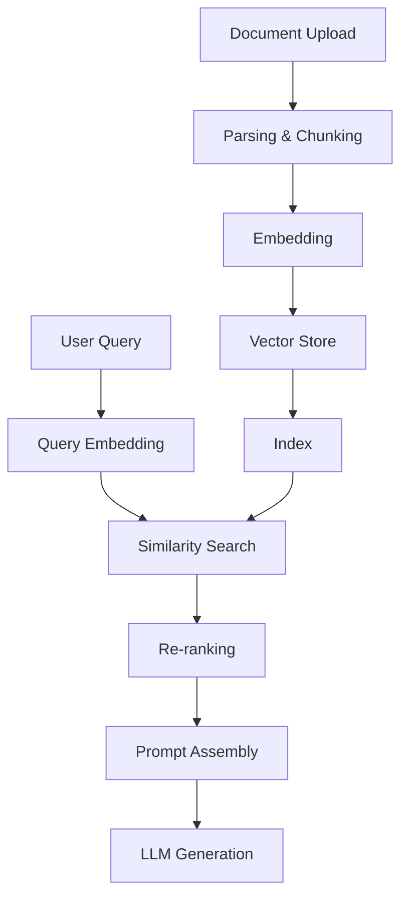

# RAG（检索增强生成）

RAG 通过在生成答案之前从您自己的数据中检索相关上下文来增强 LLM 响应。 DB-GPT 提供了全面的 RAG 框架，支持多种检索策略。

## RAG 的工作原理

1. **用户提问**
2. **检索器**在您的知识库中搜索相关文档
3. **上下文**由检索到的块组装而成
4. **LLM** 生成基于检索到的上下文的答案

## 知识库类型

DB-GPT 开箱即用地支持多种知识库类型：

|类型 |存储|最适合 |
|---|---|---|
| **矢量** | ChromaDB、Milvus、OceanBase |语义相似度搜索|
| **知识图谱** |图图、Neo4j |实体关系、结构化问答 |
| **关键字 (BM25)** |内置|关键词精准匹配|
| **混合** |组合多个|两全其美的检索 |

## 支持的文件格式

上传和处理各种文档格式：

- **文档**：PDF、Word (.docx)、Markdown、TXT
- **电子表格**：Excel (.xlsx)、CSV
- **Web**：HTML、URL
- **代码**：Python、Java 和其他源文件

## RAG 管道

DB-GPT 中完整的 RAG 管道：

### 关键步骤

1. **解析**——从上传的文档中提取文本
2. **分块** — 将文本分割成可管理的片段
3. **Embedding** — 将块转换为向量表示
4. **存储** — 将向量存储在向量数据库中
5. **检索** — 查找给定查询的相关块
6. **重新排名** - 可以选择重新排名结果以获得更好的相关性
7. **一代** — 向 LLM 提供上下文 + 查询

## RAG 快速入门

1. 打开 DB-GPT Web UI
2. 导航至侧边栏中的**知识库**
3.创建新的知识库
4. 上传您的文件
5.等待处理完成
6. 开始与您的知识库聊天

有关编程访问的信息，请参阅 [RAG Cookbook](/docs/cookbook/rag/graph_rag_app_develop)。

## 接下来是什么

- [知识库 UI](/docs/getting-started/web-ui/knowledge-base) — 在 Web UI 中管理知识库
- [Graph RAG](/docs/application/graph_rag) — 基于知识图的检索
- [RAG 模块](/docs/modules/rag) — 深入了解 RAG 框架
- [RAG 开发指南](/docs/cookbook/rag/graph_rag_app_develop) — 以编程方式构建 RAG 应用程序