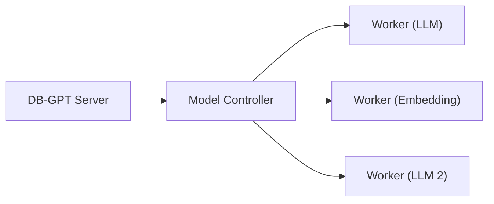

# SMMF（面向服务的多模型管理框架）

SMMF是DB-GPT的模型管理层。它提供了一个统一的界面，用于管理、切换和部署多个 LLM 和嵌入模型 - 无论它们是 API 代理还是本地托管。

## 为什么选择 SMMF？

不同的任务受益于不同的模型。 SMMF 让您：

- **同时运行多个模型**（例如，一个用于聊天，一个用于嵌入）
- **切换模型**无需更改代码 - 只需更新配置
- **独立扩展** — 在集群模式下将模型部署在单独的机器上
- **混合提供商** — 使用 OpenAI 进行聊天并使用本地模型进行嵌入

## 支持的提供商

### API 代理

|供应商|配置前缀|示例模型|
|---|---|---|
| **开放人工智能** | `代理/openai` | GPT-4o、GPT-4o-迷你 |
| **深度搜索** | `代理/deepseek` | DeepSeek-V3、DeepSeek-R1 |
| **Qwen（统一）** | `代理/统一` | Qwen-Max、Qwen-Plus |
| **SiliconFlow** | `代理/siliconflow` |各种托管模型 |
| **奥拉马** | `代理/ollama` |任何 Ollama 服务的模型 |
| **Azure OpenAI** | `代理/openai` | Azure 托管的 OpenAI 模型 |

### 局部推理

|供应商|配置前缀|要求|
|---|---|---|
| **拥抱脸** | `hf` | GPU推荐|
| **vLLM** | `vllm` | NVIDIA GPU + CUDA |
| **骆驼.cpp** | `骆驼.cpp` | CPU 或 GPU |
| **MLX** | `mlx` |苹果硅Mac |

## 配置

模型在 `configs/` 下的 TOML 文件中配置：
```toml
[models]

# LLM configuration
[[models.llms]]
name = "chatgpt_proxyllm"
provider = "proxy/openai"
api_key = "sk-..."

# Embedding model configuration
[[models.embeddings]]
name = "text-embedding-3-small"
provider = "proxy/openai"
api_key = "sk-..."
```
您可以在同一个配置文件中定义多个 LLM 和嵌入。

## 部署模式

### 独立

所有模型都在与 DB-GPT 服务器相同的进程中运行。简单，适合开发或单机部署。
```bash
uv run dbgpt start webserver --config configs/dbgpt-proxy-openai.toml
```
### 集群

模型在单独的工作节点上运行，由控制器管理。适用于具有多个 GPU 或机器的生产部署。

了解更多：[集群部署](/docs/installation/model_service/cluster)

## 接下来是什么

- [模型提供程序](/docs/getting-started/providers/) — 每个提供程序的详细设置
- [SMMF 模块](/docs/modules/smmf) — 深入探讨多模型管理
- [集群部署](/docs/installation/model_service/cluster) — 通过多个工作人员进行扩展