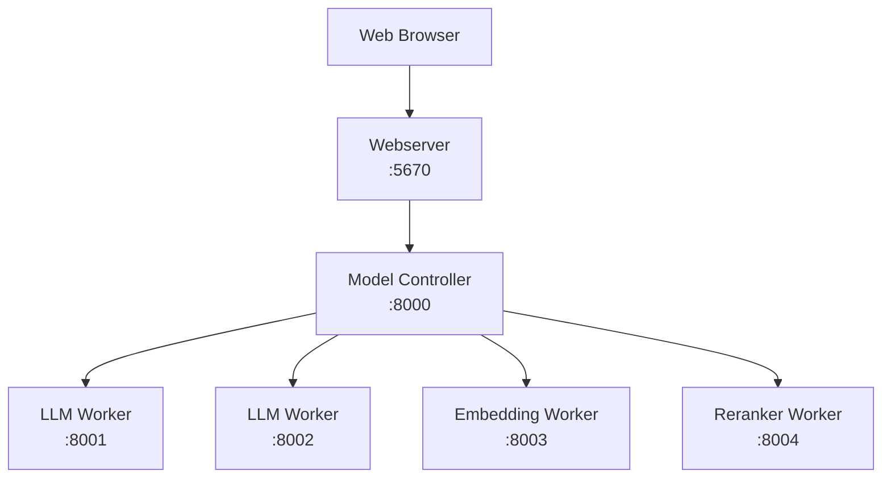

# 集群部署

将 DB-GPT 部署为分布式集群 — 将 Web 服务器、模型工作人员和控制器分开以实现可扩展性。

## 架构概述

|组件|角色 |默认端口 |
|---|---|---|
| **控制器** |服务注册和路由| 8000 |
| **法学硕士工人** |服务语言模型 | 8001+ |
| **嵌入工人** |提供嵌入模型 | 8003+ |
| **重新排名工人** |服务于模型重新排名 | 8004+ |
| **API 服务器** | REST API 网关（可选）| 8100 |
| **网络服务器** | Web UI + 应用逻辑 | 5670|

## 选项 A — 手动集群 (CLI)

### 步骤 1 — 启动控制器
```bash
dbgpt start controller
```
默认情况下，控制器在端口“8000”上启动。

### 第 2 步 — 启动 LLM 工作人员
```bash
dbgpt start worker \
  --model_name glm-4-9b-chat \
  --model_path /app/models/glm-4-9b-chat \
  --port 8001 \
  --controller_addr http://127.0.0.1:8000
```
在不同端口添加更多工作人员：
```bash
dbgpt start worker \
  --model_name vicuna-13b-v1.5 \
  --model_path /app/models/vicuna-13b-v1.5 \
  --port 8002 \
  --controller_addr http://127.0.0.1:8000
```
:::信息
将模型名称和路径替换为您自己的模型名称和路径。每个工作人员必须使用唯一的端口。
:::

### 第 3 步 — 开始嵌入工作程序
```bash
dbgpt start worker \
  --model_name text2vec \
  --model_path /app/models/text2vec-large-chinese \
  --worker_type text2vec \
  --port 8003 \
  --controller_addr http://127.0.0.1:8000
```
### 步骤 4 — 启动重新排序工作器（可选）
```bash
dbgpt start worker \
  --worker_type text2vec \
  --rerank \
  --model_name bge-reranker-base \
  --model_path /app/models/bge-reranker-base \
  --port 8004 \
  --controller_addr http://127.0.0.1:8000
```
### 步骤 5 — 验证部署的模型
```bash
dbgpt model list
```
预期输出：
```
+-------------------+------------+------+---------+
|    Model Name     | Model Type | Port | Healthy |
+-------------------+------------+------+---------+
|   glm-4-9b-chat   |    llm     | 8001 |   True  |
|  vicuna-13b-v1.5  |    llm     | 8002 |   True  |
|     text2vec      |  text2vec  | 8003 |   True  |
| bge-reranker-base |  text2vec  | 8004 |   True  |
+-------------------+------------+------+---------+
```
### 步骤 6 — 启动网络服务器
```bash
LLM_MODEL=glm-4-9b-chat \
MODEL_SERVER=http://127.0.0.1:8000 \
dbgpt start webserver --light --remote_embedding
```
|旗帜|目的|
|---|---|
| `--光` |不要启动嵌入模型服务 |
| `--remote_embedding` |使用远程嵌入工作人员 |

---

## 选项 B — Docker Compose 集群

使用预先构建的集群 Compose 文件：
```bash
docker compose -f docker/compose_examples/cluster-docker-compose.yml up -d
```
这开始：

- **控制器** — 服务注册表
- **LLM Worker** — GPU 上的“glm-4-9b-chat”
- **嵌入 Worker** — GPU 上的“text2vec-large-chinese”
- **Webserver** — 轻量级模式下的 Web UI

:::警告
在运行之前编辑 Compose 文件以设置模型路径。默认情况下模型位于“/data/models/”。
:::

### 高可用集群

对于具有多个控制器的 HA 部署：
```bash
docker compose -f docker/compose_examples/ha-cluster-docker-compose.yml up -d
```
## CLI 参考
<details>
<summary><strong>dbgpt start worker --help</strong></summary>
关键选项：

|选项|描述 |默认|
|---|---|---|
| `--模型名称` |型号名称（必填）| — |
| `--model_path` |模型文件的路径（必需）| — |
| `--worker_type` |工作线程类型（`llm`、`text2vec`）| `llm` |
| `--端口` |工人港口| 8001|
| `--controller_addr` |控制器地址 | — |
| `--设备` |设备（`cuda`、`cpu`、`mps`）|汽车 |
| `--num_gpus` |要使用的 GPU 数量 |全部 |
| `--load_8bit` |启用 8 位量化 |假 |
| `--load_4bit` |启用 4 位量化 |假 |
| `--max_context_size` |最大上下文窗口| 4096 |

</详情>
<details>
<summary><strong>dbgpt model --help</strong></summary>
|命令|描述 |
|---|---|
| `dbgpt model list` |列出所有已注册的模型实例 |
| `dbgpt 模型启动` |启动模型实例 |
| `dbgpt model stop` |停止模型实例 |
| `dbgpt 模型重新启动` |重启模型实例 |
| `dbgpt 模型聊天` |通过 CLI 与模型聊天 |

</详情>

## 后续步骤

|主题 |链接 |
|---|---|
| Docker单容器 | [Docker](/docs/getting-started/deploy/docker) |
| Docker 组合 | [Docker Compose](/docs/getting-started/deploy/docker-compose) |
|源码部署| [源代码](/docs/getting-started/deploy/source-code) |
| SMMF 深入探讨 | [多模型管理](/docs/getting-started/concepts/smmf) |