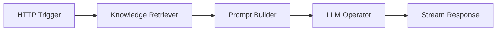

# AWEL 流程

使用 AWEL Flow 编辑器直观地构建 AI 工作流程 - 一个拖放界面，无需编写代码即可构建 LLM 管道。

## 什么是 AWEL 流程？

AWEL Flow 是 **AWEL（代理工作流表达式语言）** 的可视化编辑器。它可以让您：

- 将操作符拖放到画布上
- 将它们连接成 DAG（有向无环图）
- 配置每个操作员的参数
- 测试和部署工作流程

:::info 代码与视觉
AWEL 工作流程可以使用 Python 代码构建，也可以在流程编辑器中以可视方式构建。流编辑器生成相同的底层 DAG 结构。
:::

## 开始使用

### 第 1 步 — 打开流程编辑器

1. 导航至侧边栏中的 **Flow**
2. 单击“**创建**”开始新的工作流程

### 第 2 步 — 添加运算符

左侧面板显示按类别组织的可用运算符：

|类别 |示例 |
|---|---|
| **触发** | HTTP 触发器、计划触发器 |
| **法学硕士** |法学硕士运营商，流媒体法学硕士|
| **抹布** |知识检索器、重新排序器 |
| **代理** |代理运营商、规划|
| **数据** |数据库查询、文件读取器 |
| **转变** |文本拆分器、JSON 解析器 |
| **输出** |响应，流响应 |

将运算符从选项板拖到画布上。

### 第 3 步 — 连接运营商

单击并从一个操作员的输出端口拖动到另一个操作员的输入端口以创建连接。数据沿着这些连接流动。

### 步骤 4 — 配置操作员

单击任何操作员以打开其配置面板。设置参数如：

- 型号名称
- 提示模板
- 数据库连接
- 块大小
- 自定义逻辑

### 第 5 步 — 测试并保存

1. 单击“**运行**”以使用示例输入测试您的工作流程
2. 检查每个阶段的输出
3. 单击“**保存**”以保存工作流程

## 示例：简单的 RAG 工作流程

基本的 RAG 工作流程连接这些操作员：

1. **HTTP触发器**——接收用户的问题
2. **知识检索器** — 在知识库中搜索相关块
3. **提示生成器** — 将问题与检索到的上下文相结合
4. **LLM 操作员** — 生成答案
5. **流响应** — 返回流响应

## 在应用程序中使用流程

创建的工作流程可以用作应用程序的后端：

1. 在流程编辑器中保存您的工作流程
2. 转到 **应用程序** → **创建**
3. 选择保存的流程作为应用程序的执行引擎
4. 应用程序继承流程的输入和输出

## 管理流量

|行动|如何|
|---|---|
| **编辑** |打开流程并修改运算符/连接 |
| **重复** |创建现有流程的副本 |
| **导出** |下载 JSON 格式的流定义 |
| **导入** |上传流程定义 JSON 文件 |
| **删除** |从列表中删除流 |

## 安装社区运营商

安装后，[dbgpts 存储库](https://github.com/eosphoros-ai/dbgpts) 中的社区运算符会自动出现在 Flow 编辑器中：
```bash
dbgpts install <operator-package>
```
## 后续步骤

|主题 |链接 |
|---|---|
| AWEL 概念 | [AWEL](/docs/getting-started/concepts/awel) |
| AWEL Python 教程 | [AWEL 教程](/docs/awel/tutorial) |
| AWEL 食谱 | [AWEL 食谱](/docs/awel/cookbook) |
|社区运营商| [dbgpts](/docs/getting-started/tools/dbgpts) |