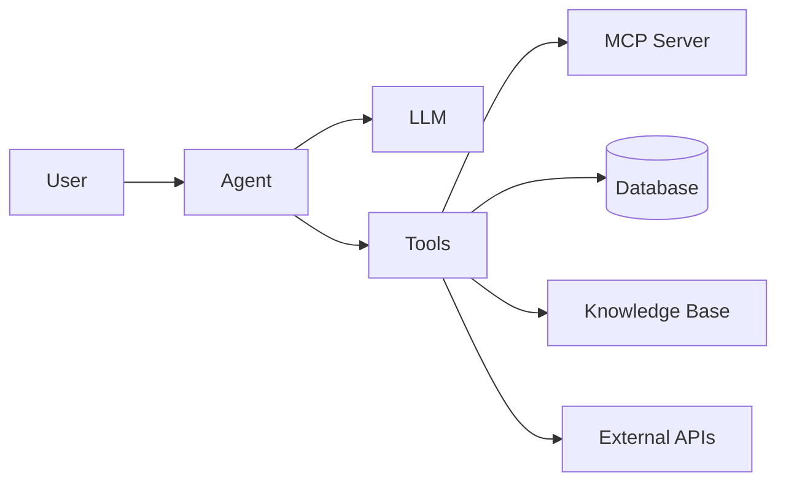

# 工具和插件

使用外部工具、社区包和可视化工作流程构建来扩展 DB-GPT。

- [MCP 协议](/docs/getting-started/tools/mcp) — 将外部工具和服务连接到代理
- [dbgpts Ecosystem](/docs/getting-started/tools/dbgpts) — 安装社区应用程序、操作员、工作流程和代理
- [AWEL Flow](/docs/getting-started/tools/awel-flow) — 在 Web UI 中直观地构建工作流程

## 概述

DB-GPT 支持三种主要的扩展机制：

|机制|它有什么作用 |何时使用 |
|---|---|---|
| **MCP 协议** |将外部工具（API、服务）连接到代理 |需要代理调用外部服务|
| **dbgpts** |安装预构建的应用程序、操作员和工作流程 |想要现成的组件 |
| **AWEL 流程** |可视化地构建 AI 管道 |需要自定义工作流程而无需编写代码 |

## 工具如何与代理配合使用

DB-GPT 中的代理可以使用工具来：

1. **访问数据**——查询数据库、搜索知识库
2. **调用API**——通过MCP与外部服务交互
3. **执行代码**——在沙盒环境中运行Python代码
4. **管理文件**——读取、写入和处理文件

## 快速链接

|主题 |链接 |
|---|---|
| AWEL 概念 | [AWEL](/docs/getting-started/concepts/awel) |
|代理框架| [代理](/docs/getting-started/concepts/agents) |
|代理开发| [开发指南](/docs/agents/introduction/tools) |