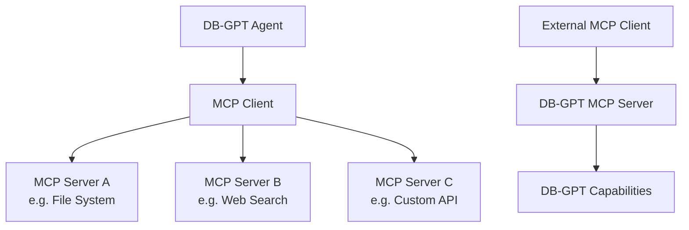

#MCP协议

**模型上下文协议 (MCP)** 使 DB-GPT 代理能够通过标准化接口与外部工具和服务连接。

:::info 什么是 MCP？
MCP 是一种开放协议，为 AI 应用程序与外部数据源和工具连接提供标准方式。 DB-GPT 支持 MCP 作为**客户端**（使用 MCP 工具）和**服务器**（将 DB-GPT 功能作为 MCP 工具公开）。
：：：

＃＃ 建筑学

## 在代理中使用 MCP 工具

### 步骤 1 — 配置 MCP 服务器

MCP 服务器在 TOML 配置文件中或通过 Web UI 的代理配置进行配置。

**TOML 配置示例：**
```toml
[[agent.mcp_servers]]
name = "filesystem"
command = "npx"
args = ["-y", "@modelcontextprotocol/server-filesystem", "/path/to/directory"]

[[agent.mcp_servers]]
name = "web-search"
command = "npx"
args = ["-y", "@modelcontextprotocol/server-brave-search"]
env = { BRAVE_API_KEY = "${env:BRAVE_API_KEY}" }
```
### 第 2 步 — 为代理分配工具

在网络用户界面中：

1. 转到 **应用程序** → 创建或编辑应用程序
2. 在代理配置中，选择可用的 MCP 工具
3. 代理现在可以在对话期间使用这些工具

### 第 3 步 — 在聊天中使用

与启用 MCP 的代理聊天时，代理会根据您的请求自动选择并调用适当的工具。

## 支持的 MCP 服务器类型

|类型 |描述 |示例|
|---|---|---|
| **标准输入输出** |本地进程通信|文件系统访问、代码执行 |
| **上交所** |服务器通过 HTTP 发送的事件 |远程 API、云服务 |

## 常见的MCP服务器

|服务器|目的|套餐 |
|---|---|---|
|文件系统 |读/写本地文件 | `@modelcontextprotocol/服务器文件系统` |
|勇敢寻找|网络搜索| `@modelcontextprotocol/server-brave-search` |
| GitHub |存储库操作 | `@modelcontextprotocol/server-github` |
| PostgreSQL |数据库查询| `@modelcontextprotocol/server-postgres` |
|松弛|发送/阅读 Slack 消息 | `@modelcontextprotocol/server-slack` |

:::tip 查找 MCP 服务器
在 [MCP 服务器目录](https://github.com/modelcontextprotocol/servers) 中浏览不断发展的 MCP 服务器生态系统。
:::

## DB-GPT 作为 MCP 服务器

DB-GPT 还可以将其功能公开为 MCP 服务器，允许其他 MCP 兼容应用程序使用 DB-GPT 功能，例如：

- 知识库查询
- 数据库访问（Text2SQL）
- 代理执行

## 后续步骤

|主题 |链接 |
|---|---|
|代理概念| [代理](/docs/getting-started/concepts/agents) |
|使用工具开发代理| [工具开发](/docs/agents/introduction/tools) |
| dbgpts 社区工具 | [dbgpts](/docs/getting-started/tools/dbgpts) |