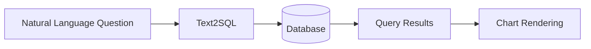

# 仪表板

使用自然语言创建数据可视化和报告。 DB-GPT 将您的问题转换为 SQL 查询并将结果呈现为交互式图表。

## 它是如何工作的

1.您用自然语言询问有关您的数据的问题
2. DB-GPT生成适当的SQL查询
3. 查询针对您连接的数据库运行
4. 结果以图表、表格或报告的形式呈现

## 开始使用

### 先决条件

- 连接到 DB-GPT 的数据库（请参阅[数据源](/docs/getting-started/concepts/data-sources)）
- 加载测试数据（可选 - 使用内置示例）

### 使用仪表板

1. 导航至侧边栏中的**聊天**
2. 选择 **聊天仪表板** 模式（或开始仪表板对话）
3. 从下拉列表中选择您的目标数据库
4.询问有关您的数据的问题

**问题示例：**
```
Show me monthly sales trends as a line chart
What are the top 5 products by revenue? Show as a bar chart
Create a pie chart of customer distribution by region
```
## 图表类型

DB-GPT 的可视化引擎（[GPT-Vis](https://github.com/eosphoros-ai/GPT-Vis)）支持：

|图表类型 |最适合 |
|---|---|
| **条形图** |比较类别 |
| **折线图** |随时间变化的趋势|
| **饼图** |比例和分布|
| **表** |详细数据展示 |
| **散点图** |变量之间的相关性 |
| **面积图** |累计趋势|

:::tip 指导可视化
在您的问题中包含所需的图表类型以获得更精确的结果：*“将月收入显示为折线图”*。
:::

## 加载测试数据

DB-GPT 包含用于测试的示例数据：
```bash
# Linux / macOS
bash ./scripts/examples/load_examples.sh

# Windows
.\scripts\examples\load_examples.bat
```
这会将示例数据集加载到 SQLite 中，您可以立即查询。

## 获得更好结果的技巧

- **具体** —“显示 2024 年每月订单总额”比“显示一些数据”效果更好
- **命名图表类型** — 提及“条形图”、“折线图”等以进行有针对性的可视化
- **参考列名称** — 如果您了解架构，请使用实际的列名称以确保精度
- **迭代** — 根据初始结果完善您的问题

## 后续步骤

|主题 |链接 |
|---|---|
|连接更多数据库 | [数据源](/docs/getting-started/concepts/data-sources) |
|聊天模式概述 | [聊天](/docs/getting-started/web-ui/chat) |
| Text2SQL 微调 | [微调](/docs/application/fine_tuning_manual/text_to_sql) |