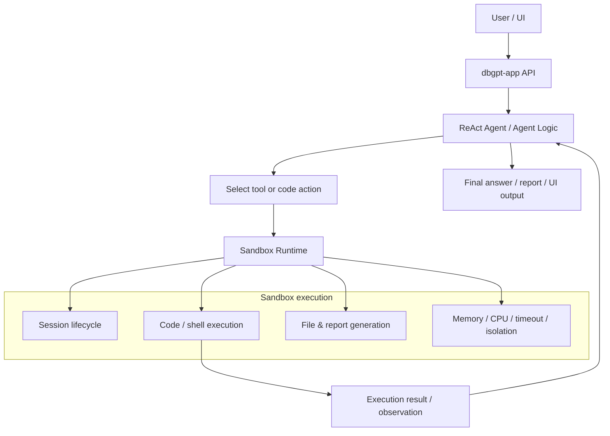
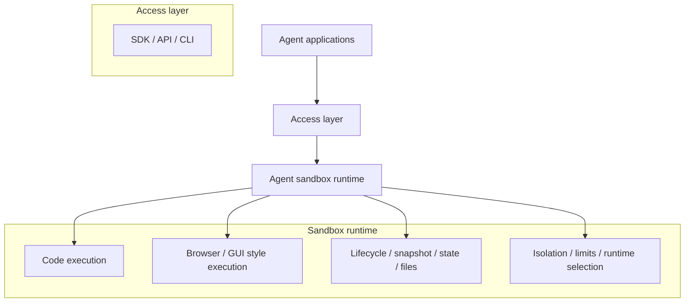

# 沙盒概述

DB-GPT 使用沙箱让代理在隔离的运行时中执行代码和工具
而不是直接在宿主环境中运行。

这对于座席工作流程很重要，因为座席通常需要做的不仅仅是
文字中的原因。它可能需要运行代码、执行 shell 命令、安装
依赖关系、生成文件并跨多个步骤保持执行状态。

沙箱是执行边界，使这些操作更安全、更高效
易于管理。

## 什么是沙箱？

在 DB-GPT 中，沙箱是代理在执行任务时使用的隔离执行环境。
需要执行代码、运行命令或操作文件作为任务的一部分。

沙盒不是让代理直接在主机系统上运行，
提供：

- 进程隔离
- 资源限制
- 受控的工作目录
- 可选的依赖安装
- 会话生命周期管理
- 推理与执行之间的清晰界限

## 沙箱如何与代理一起工作

代理决定下一步要做什么。沙箱执行该操作的**方式**
跑。

## 为什么代理需要沙箱

可以在没有隔离的情况下执行代码的代理很难安全地运行
真实环境。沙箱为 DB-GPT 提供了专用的运行时，用于执行以下操作：
如：

- 代码执行
- shell命令执行
- 依赖安装
- 文件创建和检索
- 多步骤状态分析

这对于数据分析、报告生成和工具驱动尤其重要
代理必须将推理与实际执行相结合的工作流程。

## DB-GPT当前的沙盒解决方案

DB-GPT 的沙箱实现位于：

- `packages/dbgpt-sandbox/`

当前的设计是一个分层的、可扩展的沙箱运行时，具有多个后端
选项。

### 运行时后端

运行时工厂按以下顺序自动选择最佳可用后端：

- 码头工人
- 波德曼
- 内德特尔
- 本地运行时

实施锚：

- `packages/dbgpt-sandbox/src/dbgpt_sandbox/sandbox/execution_layer/runtime_factory.py`

这使得 DB-GPT 在可用时更喜欢容器隔离，并回退到
用于开发或没有容器支持的环境的本地执行模式。

## `dbgpt-sandbox` 中的分层架构

DB-GPT 的沙箱被实现为一个具有多层的小型运行时系统。

### 1.执行层

执行层提供运行时实现和核心抽象。

- `base.py` 定义共享运行时/会话/结果/配置接口
- `docker_runtime.py`、`podman_runtime.py`、`nerdctl_runtime.py`、`local_runtime.py`
  实施具体的运行时
- `runtime_factory.py` 选择运行时后端

### 2.控制层

控制层管理任务生命周期和执行编排。

实施锚：

- `packages/dbgpt-sandbox/src/dbgpt_sandbox/sandbox/control_layer/control_layer.py`

该层处理以下操作：

- 连接
- 配置
- 执行
- 状态
- 断开连接
- 获取文件

它还管理会话创建和会话范围内的执行。

### 3.用户层

用户层暴露调用者使用的沙箱服务接口。

实施锚点：

- `packages/dbgpt-sandbox/src/dbgpt_sandbox/sandbox/user_layer/service.py`
- `packages/dbgpt-sandbox/src/dbgpt_sandbox/sandbox/user_layer/schemas.py`

### 4.显示层

显示层将输出打包为特定于运行时的显示或面向文件的
结果。

实施锚：

- `packages/dbgpt-sandbox/src/dbgpt_sandbox/sandbox/display_layer/display_layer.py`

## 会话模型和有状态执行

DB-GPT 沙箱设计的一个重要部分是它支持基于**会话的
有状态执行**。

这意味着：

- 沙盒会话可以创建一次
- 多个执行步骤可以在同一个会话中运行
- 安装的依赖项可以在后续步骤中保持可用
- 一个步骤中生成的文件可以在下一步中重复使用

这对于代理工作流程非常重要，因为任务是通过多个解决方案解决的
推理和执行轮次而不是单个工具调用。

## DB-GPT 应用程序中的当前集成

如今，DB-GPT 已在应用程序端代理工具中使用沙箱执行。

例如，“shell_interpreter”工具：

- `packages/dbgpt-app/src/dbgpt_app/openapi/api_v1/agentic_data_api.py`

使用 `dbgpt-sandbox` `LocalRuntime` 来执行 shell 命令：

- 进程隔离
- 内存限制
- 超时限制
- 安全验证

当前的实现对于 shell 执行来说**每次调用都是无状态**：每个
工具调用创建一个临时沙箱会话并在完成后销毁它。

因此，该存储库当前包含以下两个内容：

- 更完整的“dbgpt-sandbox”设计，用于可重用的沙箱会话
- 实用的应用程序端集成已经使用工具的沙盒执行

## DB-GPT 目前支持什么

基于当前的“dbgpt-sandbox”实现，DB-GPT 正在朝着
通用代理运行时支持：

- 多运行时沙箱执行
- 安全代码和 shell 执行
- 有状态的沙箱会话
- 沙箱内的依赖安装
- 任务生命周期控制
- 从沙箱会话中检索文件

这使得沙箱适合代理场景，例如：

- 代码代理
- 数据分析代理
- 报告生成代理
- 未来扩展中的浏览器/计算机风格执行运行时

## 当前 DB-GPT 沙盒方向的高级视图

该图是概念性的。它显示了沙箱作为专用沙箱的方向
代理应用程序下的运行时层，而当前的存储库实现
已经提供了执行、控制、会话和运行时选择基础
在`dbgpt-sandbox`中。

## 关键实现锚点

- `packages/dbgpt-sandbox/README.md`
- `packages/dbgpt-sandbox/src/docs/architecture.md`
- `packages/dbgpt-sandbox/src/docs/usage.md`
- `packages/dbgpt-sandbox/src/dbgpt_sandbox/sandbox/execution_layer/runtime_factory.py`
- `packages/dbgpt-sandbox/src/dbgpt_sandbox/sandbox/control_layer/control_layer.py`
- `packages/dbgpt-app/src/dbgpt_app/openapi/api_v1/agentic_data_api.py`